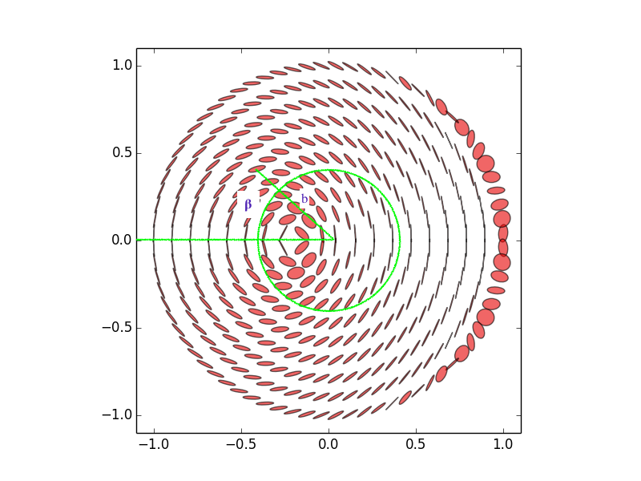
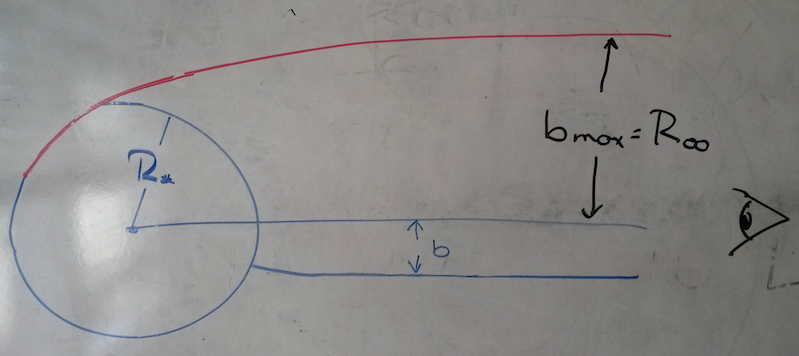

# QEDSurface

pfield will calculate the outgoing intensity in Stokes's Q using
projection of the star's the magnetic moment into the plane of
the sky as the reference direction under the assumption that at
the point of emission the intensity is entirely in the X mode
with unit value.

It samples the image evenly so that one can calculate the total
polarized flux by simply summing the product of resulting Q values
with the (X-O) intensity at the point of emission.  If your model
has emission with other polarizations (e.g. horizontal/vertical),
this program is not for you yet.

We are working on improvements for this situation to propagate all
three Stokes's parameters through the field.  These modes will be
depolarized by QED; the extent of depolarization in radians along a
trajectory is given in the final column.  Some important caveats for
this calculation are that the value of omega is limited to a maximum
value to allow the integration to proceed in a reasonable time, so the
extent of depolarization is in princple a lower limit.  On the other
hand, the magnitude of omega is determined using the weak-field limit,
so if the surface field exceeds B<sub>QED</sub>, the formula isn't strictly
correct. The value of omega achieved is probably larger than the
maximum value anyhow, so again the final column is a lower limit.

It also calculates the location in magnetic colatitude of where
the photon is emitted at the given radius as well as the initial
zenith angle and azimuth with respect to the magnetic pole.

It accounts for light bending and gravitational redshift
in the Schwarzschild metric even if the radius is less than the
photon orbit.  It also accounts for the relativistic distortion
of a centred dipole correctly.  If you examine the file
`calc_derivs.c`, you can see that you can also specify an offset
dipole or quadrupole field too (no relativity here though).

As an example, the file out18wd_30 contains the output for
nu=10<sup>18</sup>Hz and mu=10<sup>35</sup> G cm<sup>3</sup>, an
magnetized white dwarf, with the angle of 30 degrees between the
magnetic axis and the line of sight.  The output of the plotting
program plotsurfacemap.py for this case is given below where we
have indicated the meaning of the angle &beta; and the impact parameter
b.



Here a sketch of the geometry from the side.  The impact parameter is
the distance between the path of the photon far away from the star
and the line of sight from the observer to the centre of the star.  Because
of gravitational lensing it is generally larger than the distance between
the line of sight and where the photon is actually emitted.



The program outputs the value of R<sub>inf</sub> in the header for your information and
also something called x<sub>max</sub> which is the ratio of b<sub>max</sub> to
R<sub>inf</sub>.  This is one unless the stellar surface lies at a smaller radius
than the photon orbit, i.e. R &lt; 3M, a really extreme object.

Here is the help that pfield outputs if you don't type any parameters.

```
Format:

   pfield _mu_ _nu_ _mass_ _radius_ _alpha_ [optional parameters]

 _mu_     magnetic dipole moment in G cm^3
 _nu_     photon frequency in Hz [observer's frame]
 _mass_   mass of star in cm, i.e. GM/c^2
 _radius_ radius of star in cm
 _alpha_  angle of magnetic moment with line of sight in degrees

 [optional parameters]

          --doall   calculate for the top and bottom of the image
                    (for non-symmetric fields)
          --nb      number of impact parameters to calculate (10)
          optional spectral models to use
```

The format of the spectral model files is particular to a neutron-star atmosphere 
code developed by Don Lloyd.  If you are interested, I can give you further details.
